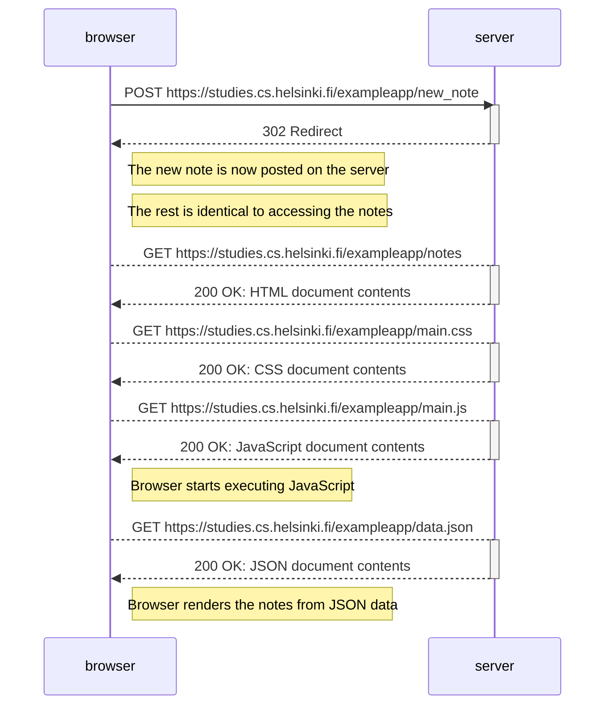
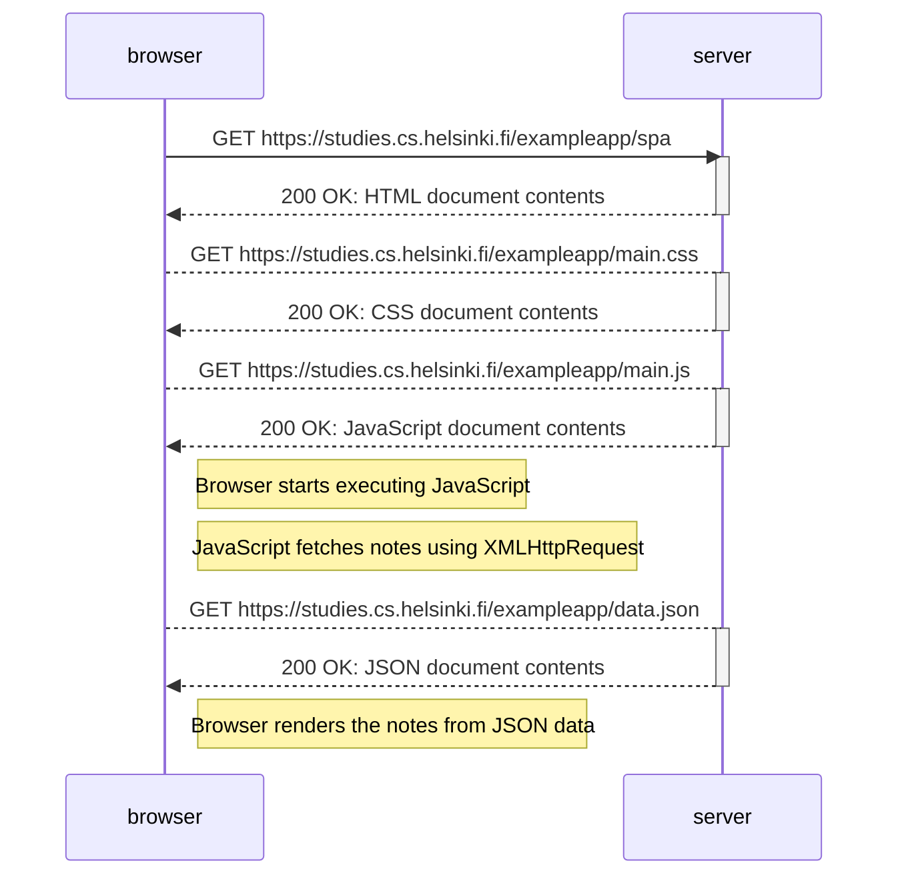
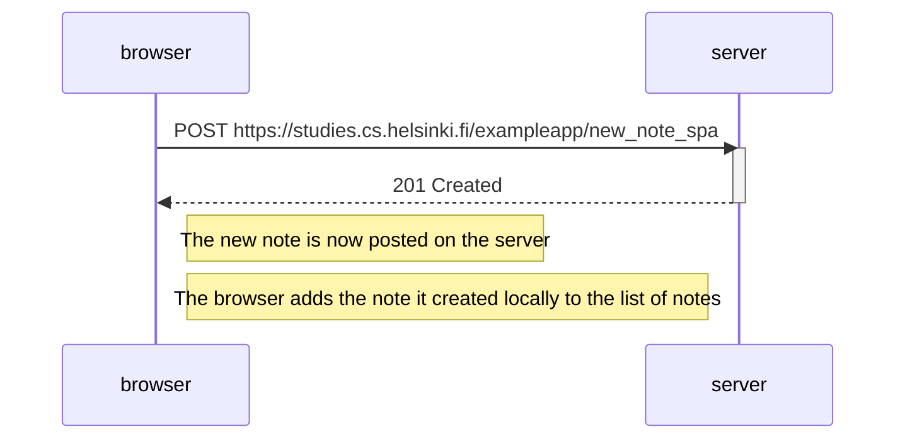

# Part 0

## Assignment 0.4

Traditional web application post new note sequence diagram

## Assignment 0.5

Single Page Application sequence diagram

## Assignment 0.6

Single Page Application post new note sequence diagram

