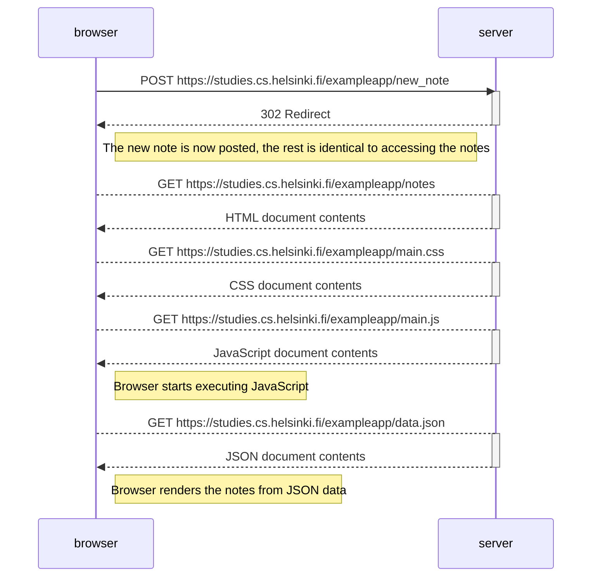
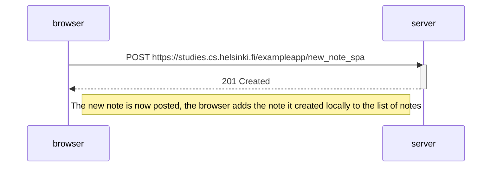
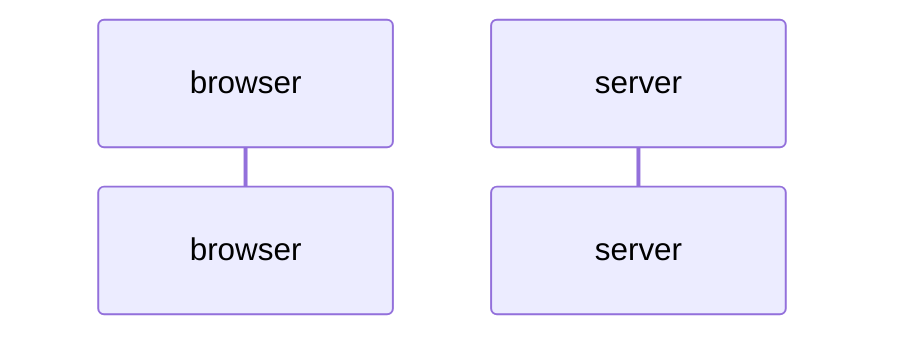

# Part 0

## Assignment 0.4

Traditional web application sequence diagram

```mermaid

sequenceDiagram
    participant browser
    participant server

    browser ->> server: POST https://studies.cs.helsinki.fi/exampleapp/new_note

    activate server
    server -->> browser: 302 Redirect
    deactivate server

    Note right of browser: The new note is now posted, the rest is identical to accessing the notes

    browser --> server: GET https://studies.cs.helsinki.fi/exampleapp/notes

    activate server
    server -->> browser: HTML document contents
    deactivate server

    browser --> server: GET https://studies.cs.helsinki.fi/exampleapp/main.css

    activate server
    server -->> browser: CSS document contents
    deactivate server

    browser --> server: GET https://studies.cs.helsinki.fi/exampleapp/main.js

    activate server
    server -->> browser: JavaScript document contents
    deactivate server

    Note right of browser: Browser starts executing JavaScript

    browser --> server: GET https://studies.cs.helsinki.fi/exampleapp/data.json

    activate server
    server -->> browser: JSON document contents
    deactivate server

    Note right of browser: Browser renders the notes from JSON data

```
## Assignment 0.5

Single Page Application sequence diagram

```mermaid

sequenceDiagram
    participant browser
    participant server

    browser ->> server: POST https://studies.cs.helsinki.fi/exampleapp/new_note_spa

    activate server
    server -->> browser: 201 Created
    deactivate server

    Note right of browser: The new note is now posted, the browser adds the note it created locally to the list of notes
```

## Assignment 0.6

```mermaid

sequenceDiagram
    participant browser
    participant server
    
    
```
 